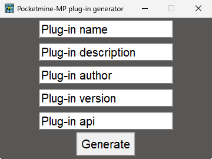

<p align="center">
    
</p>

# Pocketmine-MP plug-in generator


## Generates pocketmine-mp plugin skeleton

---

### Installation

```bash
git clone https://github.com/QuestOfHerobrine-Developpement/Pocketmine-MP-plug-in-generator
```
```bash
cd Pocketmine-MP-plug-in-generator
```

### Usage



#### Parametres

 - `Plug-in name` - Enter the name of your plug-in, it should not contain any special characters, just upper and lower case letters.
 - `Plug-in description` - Enter the description of your plug-in.
 - `Plug-in author` - Enter your username, it should not contain any special characters, just upper and lower case letters.
 - `Plug-in version` - Enter the version of your plug-in, for example 0.0.1 or 1.0.0 etc.
 - `Plug-in api` - Enter the pocketmine-mp api version you are using, for example 4.0.0 or 5.0.0.

#### When you're finished, click on "Generate".

### Contributors

| Creators                                | Contribution                            |
|-----------------------------------------|-----------------------------------------|
| [JustTim](https://github.com/JustTimmm) | Creator of the interface                |
| [Vaizeur](https://github.com/VaizHD)    | Creator of the plug-in generation script|

## License

[MIT License](LICENSE)
